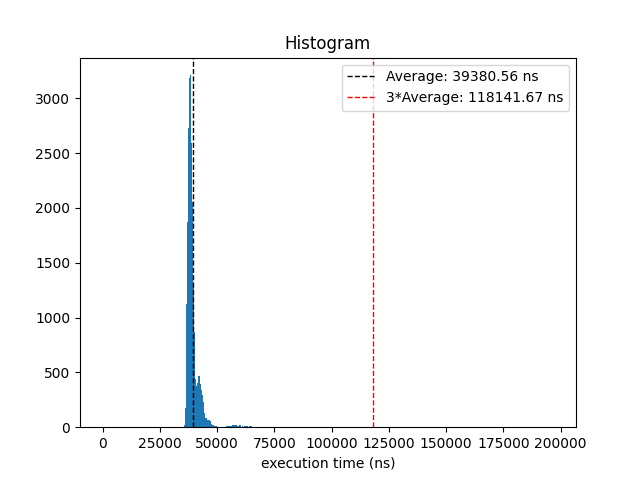
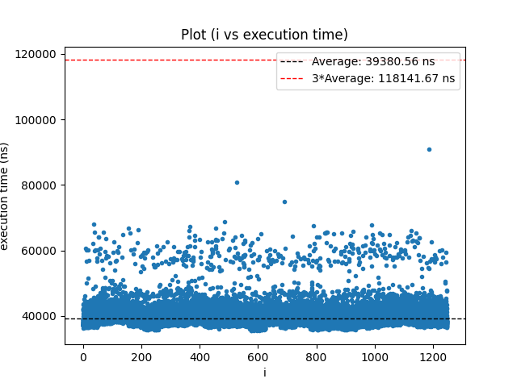

One fundamental rule of Substrate Runtime development is that there should never be function calls that execute 
non-linearly. That can make it very hard to predict how its execution will impact block-production.

Although conveniently able to compile to WebAssembly, `cozy_chess` crate wasn't written with Substrate in mind. That 
means that there is no guarantee that its execution will be linear.

While that is no problem for most extrinsics of `pallet_chess`, it does make the `make_move` extrinsic potentially 
dangerous. That's because this extrinsic has a call to the [`Board::is_legal`](https://docs.rs/cozy-chess/0.3.1/cozy_chess/struct.Board.html#method.is_legal)
method provided by `cozy_chess`, which is responsible for checking the legality of a move, given some board state. 
This represents a problem to us for a few different reasons:
- There's no guarantee of constant execution time.
- There's no input parameter from which we can linearly predict the execution time.
- The number of possible execution scenarios is virtually infinite.

Therefore, a heuristic approach based on statistics is necessary. The rationale goes as follows:
1. We benchmark every possible move for a limited (but rich) set of board states.
2. We find a statistical pattern around the execution time for all those moves.
3. We establish a "safe" constant weight for the `make_move` extrinsic, which is applied regardless of board state 
   and move.

This design was applied to [`src/benchmarking.rs`](../src/benchmarking.rs). While there's nothing special about the benchmarks for 
`create_match`, `abort_match` and `join_match`, the benchmark for `make_move` does some tricks to solve the 
issue described above.

The `POSITIONS` constant is an array with 25 different board states. The `generate_moves` function generates an 
array with every possible move for some given board state. Because different board states can have different numbers of 
possible moves, the largest value was empirically collected (52) and set as the `MOVES_PER_POSITION` constant. 
In order to have `generate_moves` always output arrays with the same length, moves are repeated until the array 
is filled with `MOVES_PER_POSITION` moves.

The benchmark for `make_move` essentially "tricks" the Substrate benchmarking mechanics by making it "believe" that 
there's a linear input parameter `i`. This parameter `i` is set to range between 0 and the product between the 
number of board states and `MOVES_PER_POSITION`, and it is used in the generation of each move to be benchmarked. 
This way, we guarantee that all moves are being benchmarked. There are however some known limitations with this 
approach:
- Some moves are repeated many times (board states with very few possible moves), which can 
  potentially skew the results. We'll address this later.
- This strategy is not exhaustive, meaning that it does not cover every possible scenario. That means that there 
  could always be some combination of a board state and a move that will take more execution time than we accounted 
  for. However,  it is practically impossible to evaluate every possible scenario, and we need some sort of 
  compromise. Our strategy could be potentially improved by adding more board states to `POSITIONS`.

The benchmark was executed in an equivalent to Polkadot's [recommended reference hardware](https://wiki.polkadot.network/docs/maintain-guides-how-to-validate-polkadot#reference-hardware)
with the following command:

```
$ ./target/release/node-template benchmark pallet \
--chain dev \
--execution=wasm \
--wasm-execution=compiled \
--pallet pallet_chess \
--extrinsic "*" \
--steps 1248 \
--repeat 20 \
--output weights.rs \
--json-file=benchmarks.json
```

The number of steps was set to `24 * 52 = 1248`, and the results were collected into `weights.rs` and `benchmarks.json`.

The original weight generated into `weights.rs` looked like:
```
	// Storage: Chess Matches (r:1 w:1)
	/// The range of component `i` is `[0, 1248]`.
	fn make_move(i: u32, ) -> Weight {
		Weight::from_ref_time(32_180_000 as u64)
			// Standard Error: 174
			.saturating_add(Weight::from_ref_time(28_771 as u64).saturating_mul(i as u64))
			.saturating_add(T::DbWeight::get().reads(1 as u64))
			.saturating_add(T::DbWeight::get().writes(1 as u64))
	}
```

Remember that we "tricked" Substrate's benchmarking mechanics, so it applied the linear regression while "believing" 
that `i` was a real variable and arrived to `W = 32_180_000 + 28_771 * i` (ignoring storage r/w). According to this 
linear regression, the minimal possible weight is `W_min = 32_180_000` and the maximum is  `W_max = 68_086_208`. 
Since this is a linear slope, we extrapolate the average weight as `W_avg = (W_min + W_max) / 2 = 
50_133_104`.

The Python script `analysis.py` was used to generate a histogram and a plot (`i` vs `execution time`) with all the
samples contained in `benchmarks.json`. We can also see the average, as well as the average multiplied by 3:





We can see that there's no samples beyond of the red dashed line, so we assume that we can multiply the average 
weight by 3 and use it as a "safe" constant extrinsic weight for `make_move`. Even if the average is heavily skewed by 
the repetition of moves on `generate_moves`, the plots show that the multiplication by 3 helps us find a safe 
upper limit, regardless of whether this is a "true" average or not.

So we will attribute `make_move` a constant weight of `W_mm = W_avg * 3 = 50_133_104 * 3 = 150_399_312`.

After applying the logic explained above to `weights.rs`, `make_move` looks like this:
```
	// Storage: Chess Matches (r:1 w:1)
	fn make_move() -> Weight {
		Weight::from_ref_time(150_399_312 as u64)
			.saturating_add(T::DbWeight::get().reads(1 as u64))
			.saturating_add(T::DbWeight::get().writes(1 as u64))
	}
```